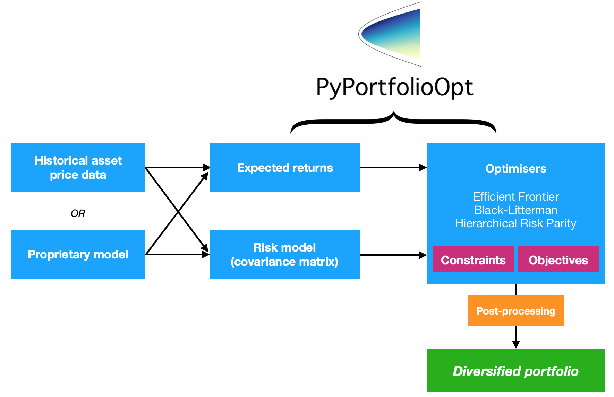

# Summary

Portfolio construction is a critically important aspect of investment management. Even after an investor selects a set of assets or return streams to invest in, it is a nontrivial task to decide how much should be allocated to each. The expected return of the asset is certainly an important factor, but the investor may also wish to consider the investment risks and the co-dependence of asset returns.

Modern Portfolio Theory, introduced by @markowitz1952, presents a mathematical framework for maximizing a portfolio's expected returns subject to a risk constraint (measuring risk with the covariance matrix of asset returns). While optimization problems are difficult in general, many portfolio optimization tasks can be framed as **convex optimization** problems, inviting the use of a large body of theory and several efficient solving routines [@boyd-cvxopt].

PyPortfolioOpt is a python package that implements financial portfolio optimization techniques, including classical mean-variance optimization (MVO) methods, Black-Litterman allocation [@BlackLitterman], and modern methods such as the machine learning-inspired Hierarchical Risk Parity algorithm [@HRP].

PyPortfolioOpt is currently being used by several financial services companies; it has been downloaded over 160,000 times, cited in academic publications [@StefanJansen; @DerekSnow], and used in numerous online courses and tutorials [@refinitiv; @datacamp].

# Statement of need

There are several open-source solvers for convex optimization problems (most of which have python interfaces), for example, CVXOPT [@cvxopt], OSQP [@osqp] and ECOS [@ecos]. However, these solvers require the user to write their problem in a particular canonical form, creating a barrier to entry for those lacking the prerequisite technical background.

Domain-specific languages like CVXPY [@diamond2016] offer a significant improvement in usability. CVXPY allows users to specify their convex optimization problem in intuitive syntax; it then identifies the most suitable solver and rewrites the problem in the appropriate canonical form [@agrawal2018]. In the example below, CVXPY is used to maximize the return of a long-only portfolio subject to the constraint that portfolio volatility may not exceed 20%.

```python
import cvxpy as cp

mu = ... # N x 1 vector of expected returns
S = ... # N x N covariance matrix

w = cp.Variable(N)  # weights to optimize
problem = cp.Problem(
    objective=cp.Maximize(w @ mu),
    constraints=[
        w >= 0,
        cp.sum(w) == 1,
        cp.quad_form(w, S) <= 0.20 ** 2,
    ],
)
problem.solve()
weights = w.value
```

CVXPY requires the user to know the mathematical formulation of their optimization problem and to construct the appropriate expressions from CVXPY atomic functions (e.g. `cvxpy.sum` and `cvxpy.quad_form` above).

PyPortfolioOpt was built on the belief that there are many investors who understand the broad concepts related to portfolio optimization (i.e. they know their objectives and constraints) but are either unable or unwilling to solve the mathematical optimization problem. To that end, PyPortfolioOpt seeks to abstract away as much of the mathematics as possible. Contrast the previous CVXPY-based script to the PyPortfolioOpt solution to the same problem:

```python
from pypfopt import EfficientFrontier

mu = ... # N x 1 vector of expected returns
S = ... # N x N covariance matrix
ef = EfficientFrontier(mu, S, weight_bounds=(0, 1))
weights = ef.efficient_risk(target_volatility=0.20)
```

Prior to the release of PyPortfolioOpt, there were several implementations of portfolio optimization routines in Python. However, to the best of our knowledge, PyPortfolioOpt was the first project offering an API for general portfolio optimization (i.e. a library rather than a script).

# Methods

A full discussion of the package's functionality may be found on the documentation website [@readthedocs] -- the documentation is open-source and hosted by ReadTheDocs. This notwithstanding, we provide a brief survey of the methods available in PyPortfolioOpt v1.4.1:

- Expected returns: simple methods for estimating expected asset returns
- Risk models: methods for estimating the covariance matrix of asset returns, such as Ledoit-Wolf shrinkage [@ledoitwolf]
- Mean-variance optimization with a flexible API for adding constraints
- General efficient frontier:
  - Mean-semivariance optimization [@estrada2007;@markowitz-semivar]
  - Mean-CVaR optimization [@cvar-opt]
  - Support for custom optimization problems, e.g minimizing tracking error
- Black-Litterman allocation [@BlackLitterman]
- Hierarchical Risk Parity [@HRP]
- Critical Line Algorithm [@cla]
- Post-processing: helper methods for converting optimal weights into a discrete allocation
- Plotting routines to visualise the efficient frontier

In the investment management industry, market participants are often incentivised to keep their work proprietary to reduce alpha decay. To that end, PyPortfolioOpt has been designed with modularity in mind, such that users can "plug-in" their own innovations when appropriate while deferring to standard methods elsewhere. PyPortfolioOpt integrates seamlessly with pandas dataframes [@pandas] and NumPy arrays [@numpy], which are commonly used in data analysis. \autoref{fig:flowchart} summarises the overall workflow of PyPortfolioOpt:



PyPortfolioOpt is actively maintained and developed. The current feature roadmap includes conditional drawdown optimization [@drawdown], risk parity portfolios [@spinu2013], higher moment optimization [@highermoments], and factor models.

# Acknowledgements

We would like to thank the following individuals for their contributions to the package's functionality and usability (in no particular order): Philipp Schiele, Nicolas Knudde, Felipe Schneider, Carl Peasnell, Rich Caputo, Dingyuan Wang, Pat Newell, Aditya Bhutra, Thomas Schmelzer, and any future contributors. The CVXPY team, in particular Steven Diamond, have been ever-supportive.

We further acknowledge Marcos López de Prado, whose code for the Critical Line Algorithm and Hierarchical Risk Parity has been used with permission.

Finally, we are grateful to all of the PyPortfolioOpt's users. Their comments and feedback have been instrumental in the improvement of the package.

# References
